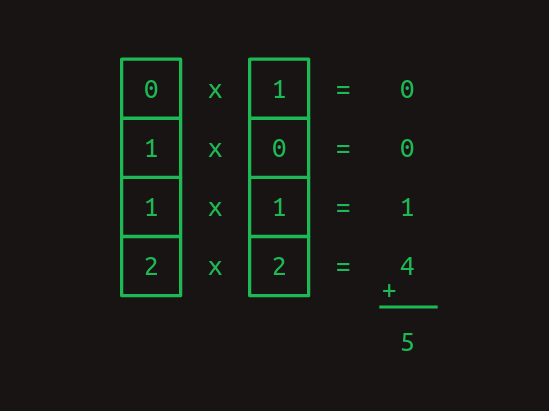
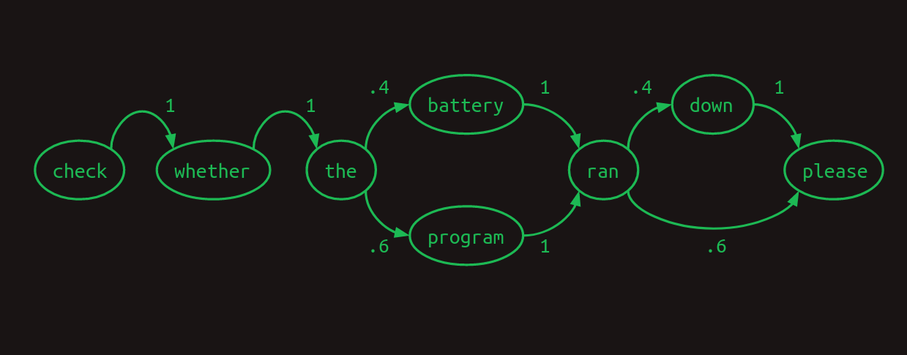
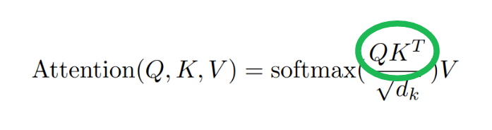
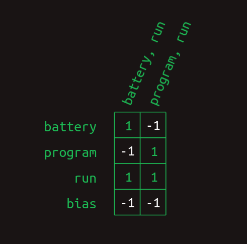
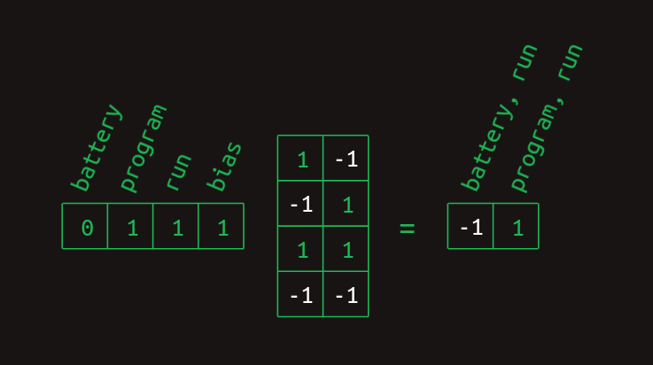
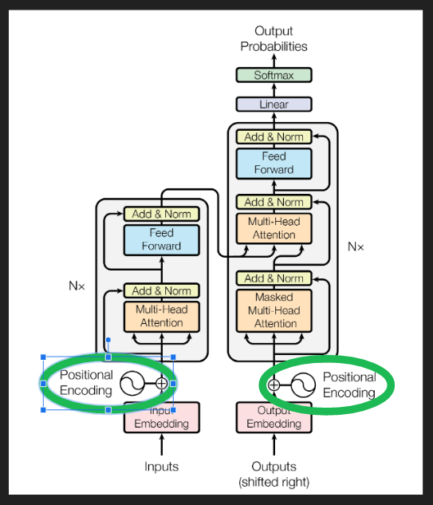
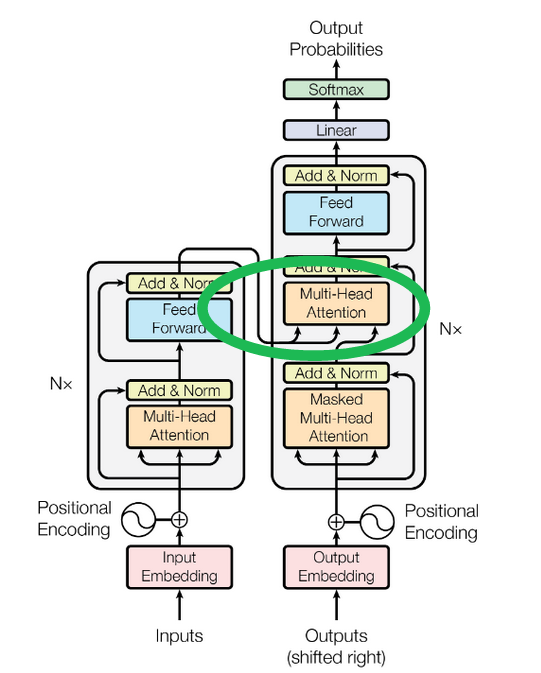

# Transformadores desde Cero

#### [Brandon Rohrer](https://e2eml.school/) 

Pospuse una inmersión profunda en los transformadores durante unos años. Finalmente, la incomodidad de no saber qué los hace funcionar creció demasiado para mí. Aquí está esa inmersión.

Los transformadores se introdujeron en este [artículo](https://proceedings.neurips.cc/paper/2017/file/3f5ee243547dee91fbd053c1c4a845aa-Paper.pdf) de 2017 como una herramienta para la transducción de secuencias, es decir, convertir una secuencia de símbolos en otra. Los ejemplos más populares de esto son la traducción, como de inglés a alemán. También se ha modificado para realizar la completación de secuencias: dado un inicio, continuar en el mismo tono y estilo. Rápidamente se han convertido en una herramienta indispensable para la investigación y el desarrollo de productos en el procesamiento del lenguaje natural.

Antes de comenzar, un aviso. Vamos a hablar mucho sobre multiplicaciones de matrices y tocar sobre la retropropagación (el algoritmo para entrenar el modelo), pero no necesitas saber nada de esto de antemano. Añadiremos los conceptos que necesitamos uno a uno, con explicación.

No es un viaje corto, pero espero que te alegres de haber venido.

### Codificación one-hot

Al principio estaban las palabras. Tantas palabras. Nuestro primer paso es convertir todas las palabras en números para poder hacer cálculos con ellas.

Imagina que nuestro objetivo es crear la computadora que responde a nuestros comandos de voz. Es nuestro trabajo construir el transformador que convierte (o **transduce**) una secuencia de sonidos en una secuencia de palabras.

Comenzamos eligiendo nuestro **vocabulario**, la colección de símbolos con la que vamos a trabajar en cada secuencia. En nuestro caso, habrá dos conjuntos diferentes de símbolos, uno para la secuencia de entrada que representa los sonidos vocales y otro para la secuencia de salida que representa palabras.

Por ahora, asumamos que estamos trabajando con inglés. Hay decenas de miles de palabras en el idioma inglés, y quizás algunos miles más para cubrir la terminología específica de computadoras. Eso nos daría un tamaño de vocabulario que es casi cien mil. Una forma de convertir palabras en números es comenzar a contar desde uno y asignar a cada palabra su propio número. Luego, una secuencia de palabras puede representarse como una lista de números.

Por ejemplo, considera un lenguaje pequeño con un tamaño de vocabulario de tres: *files*, *find* y *my*. Cada palabra podría intercambiarse por un número, quizás *files* = 1, *find* = 2 y *my* = 3. Entonces, la frase "Find my files", que consiste en la secuencia de palabras [*find*, *my*, *files*] podría representarse en su lugar como la secuencia de números [2, 3, 1].

Esta es una forma perfectamente válida de convertir símbolos en números, pero resulta que hay otro formato que es aún más fácil para las computadoras, la **codificación one-hot**. En la codificación one-hot, un símbolo se representa mediante una matriz de ceros en su mayoría, de la misma longitud que el vocabulario, con un solo elemento que tiene un valor de uno. Cada elemento de la matriz corresponde a un símbolo diferente.

Otra forma de pensar en la codificación one-hot es que cada palabra todavía recibe su propio número, pero ahora ese número es un índice en una matriz. Aquí está nuestro ejemplo anterior, en notación one-hot.

Así que la frase "Find my files" se convierte en una secuencia de matrices unidimensionales que, después de juntarlas, comienza a parecer una matriz bidimensional.

Aviso, usaré los términos "matriz unidimensional" y "**vector**" indistintamente. De igual manera con "matriz bidimensional" y "**matriz**".

### Producto punto

Una cosa realmente útil sobre la representación one-hot es que nos permite calcular [productos punto](https://es.wikipedia.org/wiki/Producto_punto). Estos también se conocen por otros nombres intimidantes como producto interior y producto escalar. Para obtener el producto punto de dos vectores, multiplica sus elementos correspondientes y luego suma los resultados.

Los productos punto son especialmente útiles cuando estamos trabajando con nuestras representaciones de palabras one-hot. El producto punto de cualquier vector one-hot consigo mismo es uno.

Y el producto punto de cualquier vector one-hot con cualquier otro vector one-hot es cero.

Los dos ejemplos anteriores muestran cómo los productos punto pueden usarse para medir la similitud. Como otro ejemplo, considera un vector de valores que representa una combinación de palabras con diferentes pesos. Una palabra codificada one-hot puede compararse contra él con el producto punto para mostrar cuán fuertemente está representada esa palabra.

### Multiplicación de matrices

El producto punto es el bloque de construcción de la multiplicación de matrices, una forma muy particular de combinar un par de matrices bidimensionales. Llamaremos a la primera de estas matrices *A* y a la segunda *B*. En el caso más simple, cuando *A* tiene solo una fila y *B* tiene solo una columna, el resultado de la multiplicación de matrices es el producto punto de los dos.

Observa cómo el número de columnas en *A* y el número de filas en *B* deben ser el mismo para que las dos matrices se alineen y el producto punto funcione.

Cuando *A* y *B* comienzan a crecer, la multiplicación de matrices se vuelve alucinante. Para manejar más de una fila en *A*, toma el producto punto de *B* con cada fila por separado. La respuesta tendrá tantas filas como tenga *A*.

Cuando *B* toma más columnas, toma el producto punto de cada columna con *A* y apila los resultados en columnas sucesivas.

Ahora podemos extender esto a la multiplicación de cualquier par de matrices, siempre y cuando el número de columnas en *A* sea el mismo que el número de filas en *B*. El resultado tendrá el mismo número de filas que *A* y el mismo número de columnas que *B*.

Si es la primera vez que ves esto, puede parecer innecesariamente complejo, pero te prometo que vale la pena más adelante.

#### Multiplicación de matrices como una consulta de tabla

Observa cómo la multiplicación de matrices actúa como una consulta de tabla aquí. Nuestra matriz *A* está compuesta de una pila de vectores one-hot. Tienen unos en la primera columna, la cuarta columna y la tercera columna, respectivamente. Cuando trabajamos a través de la multiplicación de matrices, esto sirve para extraer la primera fila, la cuarta fila y la tercera fila de la matriz *B*, en ese orden. Este truco de usar un vector one-hot para extraer una fila particular de una matriz es el núcleo de cómo funcionan los transformadores.

### Modelo de secuencia de primer orden

Podemos dejar de lado las matrices por un minuto y volver a lo que realmente nos importa, las secuencias de palabras. Imagina que al comenzar a desarrollar nuestra interfaz de computadora de lenguaje natural queremos manejar solo tres comandos posibles:

- *Muéstrame mis directorios por favor*.
- *Muéstrame mis archivos por favor*.
- *Muéstrame mis fotos por favor*.

Nuestro tamaño de vocabulario ahora es siete:
{*directorios, archivos, me, mis, fotos, por favor, muestra*}.

Una forma útil de representar secuencias es con un modelo de transición. Para cada palabra en el vocabulario, muestra cuál es la siguiente palabra probable. Si los usuarios preguntan sobre fotos la mitad del tiempo, archivos el 30% del tiempo y directorios el resto del tiempo, el modelo de transición se verá así. La suma de las transiciones desde cualquier palabra siempre sumará uno.

Este modelo de transición en particular se llama **cadena de Markov**, porque satisface la [propiedad de Markov](https://es.wikipedia.org/wiki/Propiedad_de_Markov) de que las probabilidades para la siguiente palabra dependen solo de las palabras recientes. Más específicamente, es un modelo de Markov de primer orden porque solo observa la única palabra más reciente. Si considerara las dos palabras más recientes, sería un modelo de Markov de segundo orden.

Nuestro descanso de las matrices ha terminado. Resulta que las cadenas de Markov se pueden expresar convenientemente en forma de matriz. Usando el mismo esquema de indexación que utilizamos al crear vectores one-hot, cada fila representa una de las palabras en nuestro vocabulario. Lo mismo ocurre con cada columna. El modelo de transición de matriz trata una matriz como una tabla de consulta. Encuentra la fila que corresponde a la palabra que te interesa. El valor en cada columna muestra la probabilidad de que esa palabra venga después. Dado que el valor de cada elemento en la matriz representa una probabilidad, todos caerán entre cero y uno. Debido a que las probabilidades siempre suman uno, los valores en cada fila siempre sumarán uno.

En la matriz de transición aquí podemos ver claramente la estructura de nuestras tres frases. Casi todas las probabilidades de transición son cero o uno. Hay solo un lugar en la cadena de Markov donde ocurre una ramificación. Después de *my*, las palabras *directorios*, *archivos* o *fotos* podrían aparecer, cada una con una probabilidad diferente. Aparte de eso, no hay incertidumbre sobre qué palabra vendrá después. Esa certeza se refleja en la matriz de transición, que tiene principalmente unos y ceros.

Podemos volver a nuestro truco de usar la multiplicación de matrices con un vector one-hot para extraer las probabilidades de transición asociadas con cualquier palabra dada. Por ejemplo, si solo queremos aislar las probabilidades de qué palabra viene después de *my*, podemos crear un vector one-hot representando la palabra *my* y multiplicarlo por nuestra matriz de transición. Esto extrae la fila relevante y nos muestra la distribución de probabilidad de cuál será la siguiente palabra.

### Modelo de secuencia de segundo orden

Predecir la siguiente palabra basándose solo en la palabra actual es difícil. Es como predecir el resto de una melodía después de recibir solo la primera nota. Nuestras posibilidades mejoran mucho si al menos podemos obtener dos notas para seguir.

Podemos ver cómo funciona esto en otro modelo de lenguaje de juguete para nuestros comandos de computadora. Esperamos que este solo vea dos frases, en una proporción de 40/60.

- *Verifica si la batería se agotó por favor*.
- *Verifica si el programa se ejecutó por favor*.

Una cadena de Markov ilustra un modelo de primer orden para esto.

Aquí podemos ver que si nuestro modelo observara las dos palabras más recientes, en lugar de solo una, podría hacerlo mejor. Cuando encuentra *batería se agotó*, sabe que la siguiente palabra será *abajo*, y cuando ve *programa se ejecutó* la siguiente palabra será *por favor*. Esto elimina una de las ramificaciones en el modelo, reduciendo la incertidumbre y aumentando la confianza. Mirar hacia atrás dos palabras convierte esto en un modelo de Markov de segundo orden. Da más contexto sobre el que basar las predicciones de la siguiente palabra. Las cadenas de Markov de segundo orden son más desafiantes de dibujar, pero aquí están las conexiones que demuestran su valor.

Para resaltar la diferencia entre los dos, aquí está la matriz de transición de primer orden,

y aquí está la matriz de transición de segundo orden.

Observa cómo la matriz de segundo orden tiene una fila separada para cada combinación de palabras (la mayoría de las cuales no se muestran aquí). Eso significa que si comenzamos con un tamaño de vocabulario de *N*, entonces la matriz de transición tiene *N*^2 filas.

Lo que esto nos da es más confianza. Hay más unos y menos fracciones en el modelo de segundo orden. Solo hay una fila con fracciones en ella, una ramificación en nuestro modelo. Intuitivamente, observar dos palabras en lugar de solo una proporciona más contexto, más información sobre la que basar una adivinanza de la siguiente palabra.

### Modelo de secuencia de segundo orden con saltos

Un modelo de segundo orden funciona bien cuando solo tenemos que mirar hacia atrás dos palabras para decidir qué palabra viene a continuación. ¿Qué pasa cuando tenemos que mirar más atrás? Imagina que estamos construyendo otro modelo de lenguaje. Este solo tiene que representar dos frases, cada una igualmente probable.

- *Verifica el registro del programa y averigua si se ejecutó por favor*.
- *Verifica el registro de la batería y averigua si se agotó por favor*.

En este ejemplo, para determinar qué palabra debería venir después de *se ejecutó*, tendríamos que mirar hacia atrás 8 palabras en el pasado. Si queremos mejorar nuestro modelo de lenguaje de segundo orden, podemos considerar modelos de tercer orden y superiores. Sin embargo, con un tamaño de vocabulario significativo, esto requiere una combinación de creatividad y fuerza bruta para ejecutarlo. Una implementación ingenua de un modelo de octavo orden tendría *N*^8 filas, un número ridículo para cualquier vocabulario razonable.

En cambio, podemos hacer algo astuto y crear un modelo de segundo orden, pero considerar las combinaciones de la palabra más reciente con cada una de las palabras que vinieron antes. Sigue siendo de segundo orden, porque solo estamos considerando dos palabras a la vez, pero nos permite retroceder más y capturar **dependencias a largo plazo**. La diferencia entre este segundo orden con saltos y un modelo de orden superior completo es que descartamos la mayor parte de la información del orden de las palabras y las combinaciones de palabras anteriores. Lo que queda todavía es bastante poderoso.

Las cadenas de Markov nos fallan completamente ahora, pero aún podemos representar el enlace entre cada par de palabras anteriores y las palabras que siguen. Aquí hemos prescindido de pesos numéricos, y en su lugar estamos mostrando solo las flechas asociadas con pesos no cero. Los pesos mayores se muestran con líneas más gruesas.

Así es como podría verse en una matriz de transición.

Esta vista solo muestra las filas relevantes para predecir la palabra que viene después de *se ejecutó*. Muestra instancias donde la palabra más reciente (*se ejecutó*) está precedida por cada una de las otras palabras en el vocabulario. Solo se muestran los valores relevantes. Todas las celdas vacías son ceros.

Lo primero que se hace evidente es que, al tratar de predecir la palabra que viene después de *se ejecutó*, ya no miramos solo una línea, sino un conjunto entero de ellas. Hemos salido del ámbito de Markov ahora. Cada fila ya no representa el estado de la secuencia en un punto particular. En cambio, cada fila representa una de muchas **características** que pueden describir la secuencia en un punto particular. La combinación de la palabra más reciente con cada una de las palabras anteriores constituye una colección de filas aplicables, tal vez una gran colección. Debido a este cambio en el significado, cada valor en la matriz ya no representa una probabilidad, sino un voto. Los votos se sumarán y compararán para determinar las predicciones de la siguiente palabra.

Lo siguiente que se hace evidente es que la mayoría de las características no importan. La mayoría de las palabras aparecen en ambas frases, por lo que el hecho de que se hayan visto no ayuda en la predicción de qué viene a continuación. Todas tienen un valor de .5. Las únicas dos excepciones son *batería* y *programa*. Tienen algunos pesos de 1 y 0 asociados con los dos casos que estamos tratando de distinguir. La característica *batería, se ejecutó* indica que *se ejecutó* era la palabra más reciente y que *batería* ocurrió en algún lugar antes en la frase. Esta característica tiene un peso de 1 asociado con *abajo* y un peso de 0 asociado con *por favor*. De manera similar, la característica *programa, se ejecutó* tiene el conjunto opuesto de pesos. Esta estructura muestra que es la presencia de estas dos palabras antes en la frase lo que es decisivo para predecir qué palabra viene a continuación.

Para convertir este conjunto de características de pares de palabras en una estimación de la siguiente palabra, se deben sumar los valores de todas las filas relevantes. Sumando hacia abajo en la columna, la secuencia *Verifica el registro del programa y averigua si se ejecutó* genera sumas de 0 para todas las palabras, excepto un 4 para *abajo* y un 5 para *por favor*. La secuencia *Verifica el registro de la batería y averigua si se agotó* hace lo mismo, excepto con un 4 para *por favor* y un 5 para *abajo*. Al comparar los totales, podemos ver que las secuencias con *batería* en el pasado suelen terminar con *abajo* y las secuencias con *programa* en el pasado suelen terminar con *por favor*. Al elegir la palabra con el total de votos más alto como la predicción de la siguiente palabra, este modelo nos da la respuesta correcta, a pesar de tener una dependencia de ocho palabras de profundidad.

### Enmascaramiento

Tras una consideración más cuidadosa, esto resulta insatisfactorio. La diferencia entre un total de votos de 4 y 5 es relativamente pequeña. Esto sugiere que el modelo no está tan seguro como podría estarlo. Y en un modelo de lenguaje más grande y orgánico, es fácil imaginar que una diferencia tan pequeña podría perderse en el ruido estadístico.

Podemos afinar la predicción eliminando todos los votos de características no informativas. Con la excepción de *battery, ran* y *program, ran*. Es útil recordar en este punto que sacamos las [filas relevantes](https://e2eml.school/transformers.html#table_lookup) de la matriz de transición multiplicándola con un vector que muestra qué características están actualmente activas. Para este ejemplo hasta ahora, hemos estado utilizando el vector de características implícito que se muestra aquí.

Incluye un uno para cada característica que es una combinación de *ran* con cada una de las palabras que vienen antes de ella. Las palabras que vienen después no se incluyen en el conjunto de características. (En el problema de predicción de la siguiente palabra, estas aún no se han visto, por lo que no es justo usarlas para predecir qué viene después). Y esto no incluye todas las demás combinaciones posibles de palabras. Podemos ignorarlas de manera segura para este ejemplo porque todas serán cero.

Para mejorar nuestros resultados, podemos además forzar las características no útiles a cero creando una **máscara**. Es un vector lleno de unos excepto para las posiciones que deseas ocultar o enmascarar, y esas se establecen en cero. En nuestro caso, nos gustaría enmascarar todo excepto *battery, ran* y *program, ran*, las únicas dos características que han sido de alguna ayuda.

Para aplicar la máscara, multiplicamos los dos vectores elemento por elemento. Cualquier valor de actividad de característica en una posición no enmascarada se multiplicará por uno y se dejará sin cambios. Cualquier valor de actividad de característica en una posición enmascarada se multiplicará por cero y, por lo tanto, se forzará a cero.

La máscara tiene el efecto de ocultar gran parte de la matriz de transición. Oculta la combinación de *ran* con todo excepto *battery* y *program*, dejando solo las características que importan.

Después de enmascarar las características no útiles, las predicciones de la siguiente palabra se vuelven mucho más fuertes. Cuando la palabra *battery* ocurre antes en la oración, la palabra después de *ran* se predice como *down* con un peso de 1 y *please* con un peso de 0. Lo que era una diferencia de peso del 25 por ciento se ha convertido en una diferencia del infinito por ciento. No hay duda de qué palabra viene después. La misma predicción fuerte ocurre para *please* cuando *program* ocurre temprano.

Este proceso de enmascaramiento selectivo es la **atención** mencionada en el título del [artículo](https://proceedings.neurips.cc/paper/2017/file/3f5ee243547dee91fbd053c1c4a845aa-Paper.pdf) original sobre transformers. Hasta ahora, lo que hemos descrito es solo una aproximación de cómo se implementa la atención en el artículo. Captura los conceptos importantes, pero los detalles son diferentes. Cerraremos esa brecha más adelante.

### Parada y una salida

Felicitaciones por haber llegado hasta aquí. Puedes detenerte si quieres. El modelo de **segunda orden selectiva con omisiones** es una forma útil de pensar en lo que hacen los transformers, al menos en el lado del decodificador. Captura, a una primera aproximación, lo que hacen los modelos de lenguaje generativos como el [GPT-3](https://en.wikipedia.org/wiki/GPT-3) de OpenAI. No cuenta la historia completa, pero representa el impulso central de ella.

Las siguientes secciones cubren más de la brecha entre esta explicación intuitiva y cómo se implementan los transformers. Estas se basan en tres consideraciones prácticas.

1. **Las computadoras son especialmente buenas en multiplicaciones de matrices.** Existe toda una industria en torno a la construcción de hardware informático específicamente para multiplicaciones rápidas de matrices. Cualquier cálculo que pueda expresarse como una multiplicación de matrices puede hacerse sorprendentemente eficiente. Es un tren bala. Si puedes meter tu equipaje en él, te llevará a donde quieras ir muy rápido.
2. **Cada paso debe ser diferenciable.** Hasta ahora solo hemos trabajado con ejemplos simplificados y hemos tenido el lujo de seleccionar manualmente todas las probabilidades de transición y valores de máscara: los **parámetros** del modelo. En la práctica, estos deben aprenderse mediante **retropropagación**, lo que depende de que cada paso de cálculo sea diferenciable. Esto significa que para cualquier cambio pequeño en un parámetro, podemos calcular el cambio correspondiente en el error del modelo o **pérdida**.
3. **El gradiente debe ser suave y bien condicionado.** La combinación de todas las derivadas para todos los parámetros es el **gradiente** de la pérdida. En la práctica, hacer que la retropropagación se comporte bien requiere gradientes que sean suaves, es decir, que la pendiente no cambie muy rápidamente a medida que haces pequeños pasos en cualquier dirección. También se comportan mucho mejor cuando el gradiente está bien condicionado, es decir, no es radicalmente más grande en una dirección que en otra. Si imaginas una función de pérdida como un paisaje, el Gran Cañón sería uno mal condicionado. Dependiendo de si viajas por el fondo o por el costado, tendrás pendientes muy diferentes que recorrer. Por el contrario, las colinas onduladas del clásico salvapantallas de Windows tendrían un gradiente bien condicionado. Si la ciencia de arquitectar redes neuronales es crear bloques de construcción diferenciables, el arte de ellas es apilar las piezas de tal manera que el gradiente no cambie demasiado rápido y sea aproximadamente del mismo tamaño en cada dirección.

### Atención como multiplicación de matrices

Los pesos de características podrían construirse de manera sencilla contando cuán a menudo ocurre cada par de palabras/transición de la siguiente palabra en el entrenamiento, pero las máscaras de atención no lo son. Hasta este punto, hemos sacado el vector de máscara de la nada. Cómo los transformers encuentran la máscara relevante importa. Sería natural usar algún tipo de tabla de búsqueda, pero ahora nos estamos enfocando intensamente en expresar todo como multiplicaciones de matrices. Podemos usar el mismo método de [búsqueda](https://e2eml.school/table_lookup) que introdujimos anteriormente apilando los vectores de máscara para cada palabra en una matriz y usando la representación one-hot de la palabra más reciente para sacar la máscara relevante.

En la matriz que muestra la colección de vectores de máscara, solo hemos mostrado el que estamos tratando de extraer, para mayor claridad.

Finalmente estamos llegando al punto donde podemos comenzar a vincularnos con el artículo. Esta búsqueda de máscara está representada por el término *QK^T* en la ecuación de atención.

La consulta *Q* representa la característica de interés y la matriz *K* representa la colección de máscaras. Debido a que está almacenada con máscaras en columnas, en lugar de filas, debe ser transpuesta (con el operador *T*) antes de multiplicar. Para cuando hayamos terminado, haremos algunas modificaciones importantes a esto, pero a este nivel captura el concepto de una tabla de búsqueda diferenciable que los transformers utilizan.

### Modelo de secuencia de segundo orden como multiplicaciones de matrices

Otro paso que hemos abordado de manera imprecisa hasta ahora es la construcción de matrices de transición. Hemos sido claros sobre la lógica, pero no sobre cómo hacerlo con multiplicaciones de matrices.

Una vez que tenemos el resultado de nuestro paso de atención, un vector que incluye la palabra más reciente y una pequeña colección de las palabras que la han precedido, necesitamos traducir eso en características, cada una de las cuales es un par de palabras. El enmascaramiento de atención nos proporciona el material bruto que necesitamos, pero no construye esas características de pares de palabras. Para hacerlo, podemos usar una red neuronal completamente conectada de una sola capa.

Para ver cómo una capa de red neuronal puede crear estos pares, la haremos a mano. Será artificialmente limpia y estilizada, y sus pesos no tendrán ninguna semejanza con los pesos en la práctica, pero demostrará cómo la red neuronal tiene la expresividad necesaria para construir estas dos características de pares de palabras. Para mantenerlo pequeño y limpio, nos centraremos solo en las tres palabras atendidas de este ejemplo, *batería*, *programa*, *corrió*.

En el diagrama de la capa arriba, podemos ver cómo los pesos actúan para combinar la presencia y ausencia de cada palabra en una colección de características. Esto también puede expresarse en forma de matriz.

Y se puede calcular mediante una multiplicación de matrices con un vector que representa la colección de palabras vistas hasta ahora.

Los elementos *batería* y *corrió* son 1 y el elemento *programa* es 0. El elemento *sesgo* siempre es 1, una característica de las redes neuronales. Al realizar la multiplicación de matrices se obtiene un 1 para el elemento que representa *batería, corrió* y un -1 para el elemento que representa *programa, corrió*. Los resultados para el otro caso son similares.

El paso final en el cálculo de estas características de combinaciones de palabras es aplicar una no linealidad de unidad lineal rectificada (ReLU). El efecto de esto es sustituir cualquier valor negativo por un cero. Esto limpia ambos resultados para que representen la presencia (con un 1) o ausencia (con un 0) de cada característica de combinación de palabras.

Con estas maniobras detrás de nosotros, finalmente tenemos un método basado en multiplicación de matrices para crear características de múltiples palabras. Aunque originalmente afirmé que estas consisten en la palabra más reciente y una palabra anterior, una mirada más cercana a este método muestra que también puede construir otras características. Cuando la matriz de creación de características se aprende, en lugar de codificarse de manera fija, se pueden aprender otras estructuras. Incluso en este ejemplo simplificado, no hay nada que impida la creación de una combinación de tres palabras como *batería, programa, corrió*. Si esta combinación ocurriera con suficiente frecuencia, probablemente terminaría siendo representada. No habría forma de indicar en qué orden ocurrieron las palabras (al menos no [todavía](https://e2eml.school/transformers.html#positional_encoding)), pero podríamos utilizar absolutamente su co-ocurrencia para hacer predicciones. Incluso sería posible hacer uso de combinaciones de palabras que ignoraran la palabra más reciente, como *batería, programa*. Estas y otras tipos de características probablemente se crean en la práctica, exponiendo la simplificación excesiva que hice cuando afirmé que los transformadores son un modelo secuencial de segundo orden con saltos selectivos. Hay más matices que eso, y ahora puedes ver exactamente qué son esos matices. Esta no será la última vez que cambiaremos la historia para incorporar más sutileza.

En esta forma, la matriz de características de múltiples palabras está lista para una multiplicación de matrices más, el modelo de secuencia de segundo orden con saltos que desarrollamos [arriba](https://e2eml.school/second_order_skips). En conjunto, la secuencia de

- multiplicación de matriz de creación de características,
- no linealidad ReLU, y
- multiplicación de matriz de transición

son los pasos de procesamiento feedforward que se aplican después de que se ha aplicado la atención. La Ecuación 2 del documento muestra estos pasos en una formulación matemática concisa.

El diagrama de arquitectura de la Figura 1 del documento muestra estos agrupados como el bloque Feed Forward.

### Compleción de secuencias

Hasta ahora solo hemos hablado sobre la predicción de la siguiente palabra. Hay un par de cosas que necesitamos añadir para que nuestro decodificador genere una secuencia larga. La primera es un **prompt**, algún texto de ejemplo para darle al transformador un comienzo y contexto en el que construir el resto de la secuencia. Se alimenta al decodificador, la columna de la derecha en la imagen de arriba, donde está etiquetado como "Outputs (shifted right)". Elegir un prompt que dé secuencias interesantes es un arte en sí mismo, llamado ingeniería de prompts. También es un gran ejemplo de cómo los humanos modifican su comportamiento para apoyar a los algoritmos, en lugar de al revés.

Una vez que el decodificador tiene una secuencia parcial para comenzar, hace una pasada hacia adelante. El resultado final es un conjunto de distribuciones de probabilidad predichas de palabras, una distribución de probabilidad para cada posición en la secuencia. En cada posición, la distribución muestra las probabilidades predichas para cada siguiente palabra en el vocabulario. No nos importan las probabilidades predichas para cada palabra establecida en la secuencia. Ya están establecidas. Lo que realmente nos importa son las probabilidades predichas para la siguiente palabra después del final del prompt. Hay varias formas de elegir qué palabra debería ser, pero la más sencilla se llama **greedy**, eligiendo la palabra con la mayor probabilidad.

La nueva palabra siguiente se añade a la secuencia, sustituida en los "Outputs" en la parte inferior del decodificador, y el proceso se repite hasta que te canses.

La única parte que aún no estamos listos para describir en detalle es otra forma de enmascaramiento, asegurando que cuando el transformador hace predicciones solo mire hacia atrás, no hacia adelante. Se aplica en el bloque etiquetado "Masked Multi-Head Attention". Lo revisaremos más tarde cuando podamos ser más claros sobre cómo se hace.

### Embeddings

Como los hemos descrito hasta ahora, los transformadores son demasiado grandes. Para un tamaño de vocabulario *N* de 50,000, la matriz de transición entre todos los pares de palabras y todas las palabras siguientes potenciales tendría 50,000 columnas y 50,000 al cuadrado (2.5 mil millones) de filas, totalizando más de 100 billones de elementos. Eso sigue siendo un desafío, incluso para el hardware moderno.

No es solo el tamaño de las matrices lo que es problemático. Para construir un modelo de lenguaje de transición estable, tendríamos que proporcionar datos de entrenamiento que ilustren cada secuencia potencial varias veces al menos. Eso superaría con creces la capacidad de los conjuntos de datos de entrenamiento más ambiciosos.

Afortunadamente, hay una solución para ambos problemas, los embeddings.

En una representación one-hot de un lenguaje, hay un elemento de vector para cada palabra. Para un vocabulario de tamaño *N*, ese vector es un espacio *N*-dimensional. Cada palabra representa un punto en ese espacio, a una unidad de distancia del origen a lo largo de uno de los muchos ejes. No he encontrado una forma excelente de dibujar un espacio de alta dimensión, pero hay una representación aproximada a continuación.

En un embedding, esos puntos de palabras se toman y reorganizan (**proyectados**, en términos de álgebra lineal) en un espacio de menor dimensión. La imagen de arriba muestra cómo podrían verse en un espacio de 2 dimensiones, por ejemplo. Ahora, en lugar de necesitar *N* números para especificar una palabra, solo necesitamos 2. Estas son las coordenadas (*x*, *y*) de cada punto en el nuevo espacio. Aquí está lo que un embedding de 2 dimensiones podría parecer para nuestro ejemplo de juguete, junto con las coordenadas de algunas de las palabras.

Un buen embedding agrupa palabras con significados similares juntas. Un modelo que trabaja con un embedding aprende patrones en el espacio embebido. Eso significa que lo que aprende a hacer con una palabra se aplica automáticamente a todas las palabras justo al lado de ella. Esto tiene el beneficio adicional de reducir la cantidad de datos de entrenamiento necesarios. Cada ejemplo da un poco de aprendizaje que se aplica a toda una vecindad de palabras.

En esta ilustración traté de mostrar que al poner componentes importantes en un área (*batería*, *registro*, *programa*), preposiciones en otra (*abajo*, *fuera*), y verbos cerca del centro (*verificar*, *encontrar*, *correr*). En un embedding real, las agrupaciones pueden no ser tan claras o intuitivas, pero el concepto subyacente es el mismo. La distancia es pequeña entre palabras que se comportan de manera similar.

Un embedding reduce el número de parámetros necesarios en una cantidad tremenda. Sin embargo, cuanto menores son las dimensiones en el espacio embebido, más información sobre las palabras originales se descarta. La riqueza de un lenguaje aún requiere un espacio considerable para exponer todos los conceptos importantes para que no se pisen unos a otros. Al elegir el tamaño del espacio embebido, podemos intercambiar carga computacional por precisión del modelo.

Probablemente no te sorprenderá saber que proyectar palabras desde su representación one-hot a un espacio embebido implica una multiplicación de matrices. La proyección es lo que las matrices hacen mejor. Comenzando con una matriz one-hot que tiene una fila y *N* columnas, y moviéndonos a un espacio embebido de dos dimensiones, la matriz de proyección tendrá *N* filas y dos columnas, como se muestra aquí.

Este ejemplo muestra cómo un vector one-hot, que representa por ejemplo *batería*, extrae la fila asociada con él, que contiene las coordenadas de la palabra en el espacio embebido. Para hacer la relación más clara, se ocultan los ceros en el vector one-hot, al igual que todas las demás filas que no se extraen de la matriz de proyección. La matriz de proyección completa es densa, cada fila contiene las coordenadas de la palabra con la que está asociada.

Las matrices de proyección pueden convertir la colección original de vectores de vocabulario one-hot en cualquier configuración en un espacio de cualquier dimensionalidad que desees. El mayor truco es encontrar una proyección útil, una que tenga palabras similares agrupadas juntas, y una que tenga suficientes dimensiones para dispersarlas. Hay algunos embeddings precomputados decentes para idiomas comunes, como el inglés. Además, como todo lo demás en el transformador, se puede aprender durante el entrenamiento.

En el diagrama de arquitectura de la figura 1 del artículo original, aquí es donde ocurre el embedding.

### Codificación Posicional

Hasta este punto, hemos asumido que se ignoran las posiciones de las palabras, al menos para las palabras que vienen antes de la palabra más reciente. Ahora vamos a corregir eso utilizando embeddings posicionales.

Hay varias formas en las que se podría introducir la información de posición en nuestra representación embebida de palabras, pero la forma en que se hizo en el transformador original fue agregar una ondulación circular.

La posición de la palabra en el espacio embebido actúa como el centro de un círculo. Se añade una perturbación a ella, dependiendo de dónde cae en el orden de la secuencia de palabras. Para cada posición, la palabra se mueve la misma distancia pero en un ángulo diferente, resultando en un patrón circular a medida que avanzas a través de la secuencia. Las palabras que están cerca unas de otras en la secuencia tienen perturbaciones similares, pero las palabras que están muy separadas se perturban en diferentes direcciones.

Dado que un círculo es una figura bidimensional, representar una ondulación circular requiere modificar dos dimensiones del espacio embebido. Si el espacio embebido consiste en más de dos dimensiones (lo cual casi siempre es el caso), la ondulación circular se repite en todos los demás pares de dimensiones, pero con diferentes frecuencias angulares, es decir, realiza un número diferente de rotaciones en cada caso. En algunos pares de dimensiones, la ondulación barrerá muchas rotaciones del círculo. En otros pares, solo barrerá una pequeña fracción de una rotación. La combinación de todas estas ondulaciones circulares de diferentes frecuencias da una buena representación de la posición absoluta de una palabra dentro de la secuencia.

Todavía estoy desarrollando mi intuición sobre por qué esto funciona. Parece agregar información de posición a la mezcla de una manera que no interrumpe las relaciones aprendidas entre palabras y atención. Para una inmersión más profunda en las matemáticas y las implicaciones, recomiendo el [tutorial](https://kazemnejad.com/blog/transformer_architecture_positional_encoding/) de codificación posicional de Amirhossein Kazemnejad.

En el diagrama de arquitectura canónica, estos bloques muestran la generación del código de posición y su adición a las palabras embebidas.

### De-embeddings

Embebir palabras hace que sean mucho más eficientes de trabajar, pero una vez que la fiesta ha terminado, necesitan ser convertidas de nuevo a palabras del vocabulario original. El de-embedding se hace de la misma manera que se hacen los embeddings, con una proyección de un espacio a otro, es decir, una multiplicación de matrices.

La matriz de de-embedding tiene la misma forma que la matriz de embedding, pero con el número de filas y columnas invertido. El número de filas es la dimensionalidad del espacio del que estamos convirtiendo. En el ejemplo que hemos estado usando, es el tamaño de nuestro espacio embebido, dos. El número de columnas es la dimensionalidad del espacio al que estamos convirtiendo: el tamaño de la representación one-hot del vocabulario completo, 13 en nuestro ejemplo.

Los valores en una buena matriz de de-embedding no son tan fáciles de ilustrar como los de la matriz de embedding, pero el efecto es similar. Cuando un vector embebido que representa, por ejemplo, la palabra *programa* se multiplica por la matriz de de-embedding, el valor en la posición correspondiente es alto. Sin embargo, debido a cómo funciona la proyección a espacios de mayor dimensión, los valores asociados con las otras palabras no serán cero. Las palabras más cercanas a *programa* en el espacio embebido también tendrán valores medianamente altos. Otras palabras tendrán valores cercanos a cero. Y es probable que haya muchas palabras con valores negativos. El vector de salida en el espacio de vocabulario ya no será one-hot o disperso. Será denso, con casi todos los valores no cero.

Está bien. Podemos recrear el vector one-hot eligiendo la palabra asociada con el valor más alto. Esta operación también se llama **argmax**, el argumento (elemento) que da el valor máximo. Así es como se hace la completación de secuencia codiciosa, como se mencionó [anteriormente](https://e2eml.school/transformers.html#sequence_completion). Es un buen primer paso, pero podemos hacerlo mejor.

Si un embedding mapea muy bien a varias palabras, podríamos no querer elegir la mejor cada vez. Podría ser solo una pequeña mejor elección que las demás, y agregar un toque de variedad puede hacer que el resultado sea más interesante. Además, a veces es útil mirar varias palabras hacia adelante y considerar todas las direcciones en las que podría ir la oración antes de decidirse por una opción final. Para hacer esto, primero tenemos que convertir nuestros resultados de de-embedding a una distribución de probabilidad.

#### Softmax

La función argmax es "dura" en el sentido de que el valor más alto gana, incluso si es solo infinitesimalmente mayor que los demás. Si queremos considerar varias posibilidades a la vez, es mejor tener una función de "máximo suave", que obtenemos de **softmax**. Para obtener el softmax del valor *x* en un vector, divide la exponencial de *x*, *e^x*, por la suma de las exponenciales de todos los valores en el vector.

El softmax es útil aquí por tres razones. Primero, convierte nuestro vector de resultados de de-embedding de un conjunto arbitrario de valores a una distribución de probabilidad. Como probabilidades, se vuelve más fácil comparar la probabilidad de que se seleccionen diferentes palabras e incluso comparar la probabilidad de secuencias de varias palabras si queremos mirar más allá en el futuro.

Segundo, adelgaza el campo cerca de la cima. Si una palabra tiene una puntuación claramente más alta que las demás, softmax exagerará esa diferencia, haciéndola parecer casi como un argmax, con el valor ganador cerca de uno y todos los demás cerca de cero. Sin embargo, si hay varias palabras que todas quedan cerca de la cima, lo preservará a todas como altamente probables, en lugar de aplastar artificialmente los resultados cercanos al segundo lugar.

Tercero, el softmax es diferenciable, lo que significa que podemos calcular cuánto cambiará cada elemento de los resultados, dado un pequeño cambio en cualquiera de los elementos de entrada. Esto nos permite usarlo con retropropagación para entrenar nuestro transformador.

Si sientes que quieres profundizar en tu comprensión del softmax (o si tienes problemas para dormir por la noche), aquí hay una [publicación](https://e2eml.school/softmax) más completa sobre el tema.

Juntos, la transformación de de-embedding (mostrada como el bloque Lineal a continuación) y una función softmax completan el proceso de de-embedding.

### Atención de múltiples cabezas

Ahora que hemos hecho las paces con los conceptos de proyecciones (multiplicaciones de matrices) y espacios (tamaños de vectores), podemos volver al mecanismo central de atención con renovado vigor. Ayudará a aclarar el algoritmo si podemos ser más específicos sobre la forma de nuestras matrices en cada etapa. Hay una lista corta de números importantes para esto.

- *N*: tamaño del vocabulario. 13 en nuestro ejemplo. Típicamente en las decenas de miles.
- *n*: longitud máxima de la secuencia. 12 en nuestro ejemplo. Algo como unos pocos cientos en el artículo. (No especifican.) 2048 en GPT-3.
- *d_model*: número de dimensiones en el espacio embebido utilizado en todo el modelo. 512 en el artículo.

La matriz de entrada original se construye tomando cada una de las palabras de la oración en su representación one-hot, y apilándolas de modo que cada uno de los vectores one-hot sea su propia fila. La matriz de entrada resultante tiene *n* filas y *N* columnas, que podemos abreviar como [*n* x *N*].

Como ilustramos antes, la matriz de embedding tiene *N* filas y *d_model* columnas, que podemos abreviar como [*N* x *d_model*]. Al multiplicar dos matrices, el resultado toma su número de filas de la primera matriz y su número de columnas de la segunda. Eso da a la matriz de secuencia de palabras embebidas una forma de [*n* x *d_model*].

Podemos seguir los cambios en la forma de la matriz a través del transformador como una forma de rastrear lo que está pasando. Después del embedding inicial, la codificación posicional es aditiva, en lugar de una multiplicación, por lo que no cambia la forma de las cosas. Luego, la secuencia de palabras embebidas pasa por las capas de atención, y sale por el otro extremo en la misma forma. (Volveremos a los detalles internos de estos en un segundo.) Finalmente, el de-embedding restaura la matriz a su forma original, ofreciendo una probabilidad para cada palabra en el vocabulario en cada posición de la secuencia.

#### Por qué necesitamos más de una cabeza de atención

Finalmente ha llegado el momento de confrontar algunas de las suposiciones simplistas que hice durante nuestro primer paso al explicar el mecanismo de atención. Las palabras se representan como vectores densos incrustados, en lugar de vectores one-hot. La atención no es solo 1 o 0, encendida o apagada, sino que también puede estar en cualquier punto intermedio. Para obtener resultados que caigan entre 0 y 1, usamos nuevamente el truco de softmax. Tiene el doble beneficio de forzar a que todos los valores se encuentren en nuestro rango de atención [0, 1], y ayuda a enfatizar el valor más alto, mientras aplasta agresivamente los más pequeños. Es el comportamiento diferencial casi-argmax del que aprovechamos antes al interpretar la salida final del modelo.

Una consecuencia complicada de poner una función softmax en la atención es que tiende a enfocarse en un solo elemento. Esta es una limitación que no teníamos antes. A veces es útil tener en cuenta varias de las palabras anteriores al predecir la siguiente, y el softmax simplemente nos robó eso. Este es un problema para el modelo.

La solución es tener varias instancias diferentes de atención, o **cabezas** funcionando al mismo tiempo. Esto permite que el transformer considere varias palabras anteriores simultáneamente al predecir la siguiente. Recupera el poder que teníamos antes de que introdujéramos el softmax en la imagen.

Desafortunadamente, hacer esto realmente aumenta la carga computacional. Calcular la atención ya era la mayor parte del trabajo, y simplemente lo multiplicamos por tantas cabezas como queramos usar. Para solucionar esto, podemos reutilizar el truco de proyectar todo en un espacio de incrustación de menor dimensión. Esto reduce las matrices involucradas, lo que disminuye drásticamente el tiempo de cálculo. El día está salvado.

Para ver cómo se desarrolla esto, podemos seguir observando las formas de las matrices. Rastrear la forma de la matriz a través de las ramas y entrelazados de los bloques de atención multi-cabeza requiere tres números más.

- *d_k*: dimensiones en el espacio de incrustación utilizadas para claves y consultas. 64 en el artículo.
- *d_v*: dimensiones en el espacio de incrustación utilizadas para valores. 64 en el artículo.
- *h*: el número de cabezas. 8 en el artículo.

La secuencia [*n* x *d_model*] de palabras incrustadas sirve como base para todo lo que sigue. En cada caso hay una matriz, *Wv*, *Wq*, y *Wk*, (todas mostradas de manera no útil como bloques "Lineales" en el diagrama de arquitectura) que transforma la secuencia original de palabras incrustadas en la matriz de valores, *V*, la matriz de consultas, *Q*, y la matriz de claves, *K*. *K* y *Q* tienen la misma forma, [*n* x *d_k*], pero *V* puede ser diferente, [*n* x *d_v*]. Confunde un poco que *d_k* y *d_v* sean iguales en el artículo, pero no tienen que serlo. Un aspecto importante de esta configuración es que cada cabeza de atención tiene sus propias transformaciones *Wv*, *Wq*, y *Wk*. Eso significa que cada cabeza puede enfocarse y ampliar las partes del espacio incrustado en las que quiere centrarse, y puede ser diferente de lo que cada una de las otras cabezas está enfocando.

El resultado de cada cabeza de atención tiene la misma forma que *V*. Ahora tenemos el problema de *h* vectores de resultado diferentes, cada uno atendiendo a diferentes elementos de la secuencia. Para combinar estos en uno solo, aprovechamos los poderes del álgebra lineal, y simplemente concatenamos todos estos resultados en una matriz gigante [*n* x *h \* d_v*]. Luego, para asegurarnos de que termine en la misma forma en que comenzó, usamos una transformación más con la forma [*h \* d_v* x *d_model*].

Aquí está todo eso, expresado de manera concisa.

### Atención de una sola cabeza revisitada

Ya hemos recorrido una ilustración conceptual de la atención [arriba](https://e2eml.school/transformers.html#attention). La implementación real es un poco más desordenada, pero nuestra intuición anterior sigue siendo útil. Las consultas y las claves ya no son fáciles de inspeccionar e interpretar porque todas están proyectadas en sus propios subespacios idiosincráticos. En nuestra ilustración conceptual, una fila en la matriz de consultas representa un punto en el espacio de vocabulario, que, gracias a la representación one-hot, representa una y solo una palabra. En su forma incrustada, una fila en la matriz de consultas representa un punto en el espacio incrustado, que estará cerca de un grupo de palabras con significados y usos similares. La ilustración conceptual mapeó una palabra de consulta a un conjunto de claves, que a su vez filtró todos los valores que no están siendo atendidos. Cada cabeza de atención en la implementación real mapea una palabra de consulta a un punto en otro espacio incrustado de menor dimensión. El resultado de esto es que la atención se convierte en una relación entre grupos de palabras, en lugar de entre palabras individuales. Aprovecha las similitudes semánticas (cercanía en el espacio incrustado) para generalizar lo que ha aprendido sobre palabras similares.

Seguir la forma de las matrices a través del cálculo de atención ayuda a rastrear lo que está haciendo.

Las matrices de consultas y claves, *Q* y *K*, llegan con forma [*n* x *d_k*]. Gracias a que *K* está transpuesto antes de la multiplicación, el resultado de *Q K^T*, da una matriz de [*n* x *d_k*] * [*d_k* x *n* ] = [*n* x *n*]. Dividir cada elemento de esta matriz por la raíz cuadrada de *d_k* ha demostrado mantener la magnitud de los valores sin crecer descontroladamente, y ayuda a que la retropropagación funcione bien. El softmax, como mencionamos, encaja el resultado en una aproximación de un argmax, tendiendo a enfocar la atención en un elemento de la secuencia más que en el resto. En esta forma, la matriz de atención [*n* x *n*] mapea aproximadamente cada elemento de la secuencia a otro elemento de la secuencia, indicando lo que debe estar observando para obtener el contexto más relevante para predecir el siguiente elemento. Es un filtro que finalmente se aplica a la matriz de valores *V*, dejando solo una colección de los valores atendidos. Esto tiene el efecto de ignorar la gran mayoría de lo que vino antes en la secuencia, y pone el foco en el único elemento anterior que es más útil tener en cuenta.

Una parte complicada para entender este conjunto de cálculos es tener en cuenta que está calculando atención para cada elemento de nuestra secuencia de entrada, para cada palabra en nuestra oración, no solo para la palabra más reciente. También está calculando atención para palabras anteriores. Realmente no nos importa esto porque sus palabras siguientes ya han sido predichas y establecidas. También está calculando atención para palabras futuras. Estas aún no tienen mucho uso, porque están demasiado lejos y sus predecesores inmediatos aún no han sido elegidos. Pero hay caminos indirectos a través de los cuales estos cálculos pueden afectar la atención de la palabra más reciente, así que los incluimos todos. Simplemente, cuando llegamos al final y calculamos las probabilidades de palabras para cada posición en la secuencia, descartamos la mayoría de ellas y solo prestamos atención a la siguiente palabra.

El bloque Mask impone la restricción de que, al menos para esta tarea de completación de secuencia, no podemos mirar hacia el futuro. Evita introducir artefactos extraños de palabras futuras imaginarias. Es crudo y efectivo: configura manualmente la atención prestada a todas las palabras más allá de la posición actual a infinito negativo. En [The Annotated Transformer](https://nlp.seas.harvard.edu/2018/04/03/attention.html), un compañero inmensamente útil del artículo que muestra implementación de Python línea por línea, se visualiza la matriz de máscara. Las celdas moradas muestran dónde no se permite la atención. Cada fila corresponde a un elemento en la secuencia. La primera fila puede atender a sí misma (el primer elemento), pero a nada después. La última fila puede atender a sí misma (el último elemento) y a todo lo que viene antes. La máscara es una matriz [*n* x *n*]. Se aplica no con una multiplicación de matrices, sino con una multiplicación más directa elemento por elemento. Esto tiene el efecto de ir manualmente a la matriz de atención y establecer todos los elementos morados de la máscara en infinito negativo.

Otra diferencia importante en cómo se implementa la atención es que utiliza el orden en el que se presentan las palabras en la secuencia, y representa la atención no como una relación palabra a palabra, sino como una relación posición a posición. Esto es evidente en su forma [*n* x *n*]. Mapea cada elemento de la secuencia, indicado por el índice de fila, a algún otro elemento(s) de la secuencia, indicado por el índice de columna. Esto nos ayuda a visualizar e interpretar lo que está haciendo más fácilmente, ya que está operando en el espacio de incrustación. Nos ahorramos el paso adicional de encontrar palabras cercanas en el espacio de incrustación para representar las relaciones entre consultas y claves.

### Conexión de salto

La atención es la parte más fundamental de lo que hacen los transformers. Es el mecanismo central, y ahora lo hemos recorrido a un nivel bastante concreto. Todo lo que sigue a partir de aquí es la plomería necesaria para que funcione bien. Es el resto del arnés que permite a la atención manejar nuestras cargas de trabajo pesadas.

Una pieza que aún no hemos explicado son las conexiones de salto. Estas ocurren alrededor de los bloques de Atención Multi-Cabeza y alrededor de los bloques de Feed Forward elemento por elemento en los bloques etiquetados como "Agregar y Normalizar". En las conexiones de salto, se agrega una copia de la entrada a la salida de un conjunto de cálculos. Las entradas al bloque de atención se agregan de nuevo a su salida. Las entradas al bloque de feed forward elemento por elemento se agregan a sus salidas.

Las conexiones de salto tienen dos propósitos.

El primero es que ayudan a mantener el gradiente suave, lo que es de gran ayuda para la retropropagación. La atención es un filtro, lo que significa que cuando funciona correctamente, bloqueará la mayor parte de lo que intenta pasar a través de ella. El resultado de esto es que los pequeños cambios en muchas de las entradas pueden no producir mucho cambio en las salidas si caen en canales que están bloqueados. Esto produce puntos muertos en el gradiente donde es plano, pero aún está lejos del fondo de un valle. Estos puntos de silla y crestas son un gran obstáculo para la retropropagación. Las conexiones de salto ayudan a suavizarlos. En el caso de la atención, incluso si todos los pesos fueran cero y todas las entradas estuvieran bloqueadas, una conexión de salto agregaría una copia de las entradas a los resultados y aseguraría que los pequeños cambios en cualquiera de las entradas aún tendrían cambios notables en el resultado. Esto evita que el descenso de gradiente se quede atrapado lejos de una buena solución.

Las conexiones de salto se han vuelto populares debido a cómo mejoran el rendimiento desde los días del clasificador de imágenes ResNet. Ahora son una característica estándar en las arquitecturas de redes neuronales. Visualmente, podemos ver el efecto que tienen las conexiones de salto comparando redes con y sin ellas. La figura a continuación del [artículo](https://arxiv.org/abs/1712.09913) muestra una ResNet con y sin conexiones de salto. Las pendientes de las colinas de la función de pérdida son mucho más moderadas y uniformes cuando se utilizan conexiones de salto. Si te interesa profundizar un poco más sobre cómo funcionan y por qué, hay un tratamiento más detallado en este [post](https://theaisummer.com/skip-connections/).

El segundo propósito de las conexiones de salto es específico de los transformers: preservar la secuencia de entrada original. Incluso con muchas cabezas de atención, no hay garantía de que una palabra atienda a su propia posición. Es posible que el filtro de atención olvide por completo la palabra más reciente en favor de observar todas las palabras anteriores que podrían ser relevantes. Una conexión de salto toma la palabra original y la agrega manualmente de nuevo a la señal, para que no haya forma de que pueda ser eliminada o olvidada. Esta fuente de robustez puede ser una de las razones del buen comportamiento de los transformers en tantas tareas variadas de completación de secuencias.

### Normalización por capas

La normalización es un paso que combina bien con las conexiones de salto. No hay razón para que necesariamente deban ir juntas, pero ambas hacen su mejor trabajo cuando se colocan después de un grupo de cálculos, como la atención o una red neuronal feed forward.

La versión corta de la normalización por capas es que los valores de la matriz se trasladan para tener una media de cero y se escalan para tener una desviación estándar de uno.

La versión más larga es que en sistemas como los transformers, donde hay muchas piezas móviles y algunas de ellas son algo más que multiplicaciones de matrices (como operadores softmax o unidades lineales rectificadas), importa qué tan grandes son los valores y cómo están equilibrados entre positivos y negativos. Si todo es lineal, puedes duplicar todas tus entradas, y tus salidas serán el doble de grandes, y todo funcionará bien. No es así con las redes neuronales. Son inherentemente no lineales, lo que las hace muy expresivas pero también sensibles a las magnitudes y distribuciones de las señales. La normalización es una técnica que ha demostrado ser útil para mantener una distribución consistente de los valores de señal en cada paso a lo largo de redes neuronales de muchas capas. Fomenta la convergencia de los valores de los parámetros y generalmente resulta en un rendimiento mucho mejor.

Lo que más me gusta de la normalización es que, aparte de explicaciones a nivel alto como la que acabo de dar, nadie está completamente seguro de por qué funciona tan bien. Si te interesa profundizar un poco más en este agujero de conejo, escribí un [post](https://e2eml.school/batch_normalization) más detallado sobre la normalización por lotes, un primo cercano de la normalización por capas utilizada en los transformers.

### Múltiples capas

Mientras estabas estableciendo los cimientos, mostramos que un bloque de atención y un bloque de avance con pesos cuidadosamente elegidos eran suficientes para crear un modelo de lenguaje decente. La mayoría de los pesos eran ceros en nuestros ejemplos, unos pocos eran unos, y todos estaban seleccionados manualmente. Cuando entrenamos con datos en bruto, no tendremos este lujo. Al principio, los pesos se eligen aleatoriamente, la mayoría están cerca de cero, y los pocos que no lo están probablemente no sean los que necesitamos. Hay un largo camino desde donde necesita estar para que nuestro modelo funcione bien.

El descenso de gradiente estocástico a través de la retropropagación puede hacer cosas bastante asombrosas, pero depende mucho de la suerte. Si solo hay una forma de llegar a la respuesta correcta, solo una combinación de pesos necesaria para que la red funcione bien, entonces es poco probable que encuentre su camino. Pero si hay muchos caminos hacia una buena solución, las posibilidades de que el modelo lo logre son mucho mayores.

Tener una sola capa de atención (solo un bloque de atención multi-cabeza y un bloque de avance) solo permite un camino hacia un buen conjunto de parámetros del transformador. Cada elemento de cada matriz necesita encontrar su camino hacia el valor correcto para que las cosas funcionen bien. Es frágil y quebradizo, propenso a quedarse atascado en una solución lejana a la ideal a menos que las conjeturas iniciales para los parámetros sean muy, muy afortunadas.

La forma en que los transformadores eluden este problema es mediante la incorporación de múltiples capas de atención, cada una utilizando la salida de la anterior como entrada. El uso de conexiones de salto hace que el pipeline general sea robusto frente a fallos o resultados erráticos de bloques de atención individuales. Tener múltiples capas significa que hay otras esperando para cubrir el vacío. Si una se sale de los rieles o de alguna manera no cumple con su potencial, habrá otra capa aguas abajo que tendrá otra oportunidad para cerrar la brecha o corregir el error. El artículo mostró que más capas resultaban en un mejor rendimiento, aunque la mejora se volvió marginal después de 6.

Otra forma de pensar en múltiples capas es como una línea de ensamblaje de cinta transportadora. Cada bloque de atención y bloque de avance tiene la oportunidad de sacar entradas de la línea, calcular matrices de atención útiles y hacer predicciones de la siguiente palabra. Los resultados que producen, útiles o no, se agregan de nuevo a la cinta transportadora y se pasan a la siguiente capa.

Esto contrasta con la descripción tradicional de redes neuronales de muchas capas como "profundas". Gracias a las conexiones de salto, las capas sucesivas no proporcionan una abstracción cada vez más sofisticada tanto como proporcionan redundancia. Cualesquiera oportunidades para enfocar la atención y crear características útiles y hacer predicciones precisas que se perdieron en una capa siempre pueden ser capturadas por la siguiente. Las capas se convierten en trabajadores en la línea de ensamblaje, donde cada una hace lo que puede, pero no se preocupa por capturar cada pieza, porque el siguiente trabajador capturará las que se pierdan.

### Pila de decodificadores

Hasta ahora hemos ignorado cuidadosamente la pila de codificadores (el lado izquierdo de la arquitectura del transformador) en favor de la pila de decodificadores (el lado derecho). Lo corregiremos en unos párrafos. Pero vale la pena notar que el decodificador por sí solo es bastante útil.

Como describimos en la tarea de finalización de secuencias [descripción](https://e2eml.school/transformers.html#sequence_completion), el decodificador puede completar secuencias parciales y extenderlas tanto como quieras. OpenAI creó la familia de modelos de pre-entrenamiento generativo (GPT) para hacer exactamente esto. La arquitectura que describen en este [informe](https://cdn.openai.com/research-covers/language-unsupervised/language_understanding_paper.pdf) debería parecer familiar. Es un transformador con la pila de codificadores y todas sus conexiones quirúrgicamente eliminadas. Lo que queda es una pila de decodificadores de 12 capas.

Cada vez que te encuentras con un modelo generativo, como [BERT](https://arxiv.org/pdf/1810.04805v2.pdf), [ELMo](https://arxiv.org/abs/1802.05365) o [Copilot](https://copilot.github.com/), probablemente estés viendo la mitad del decodificador de un transformador en acción.

### Pila de codificadores

Casi todo lo que hemos aprendido sobre el decodificador se aplica también al codificador. La mayor diferencia es que no se realizan predicciones explícitas al final que podamos usar para juzgar la corrección o incorrección de su rendimiento. En cambio, el producto final de una pila de codificadores es decepcionantemente abstracto: una secuencia de vectores en un espacio embebido. Se ha descrito como una representación puramente semántica de la secuencia, divorciada de cualquier idioma o vocabulario particular, pero esto me parece excesivamente romántico. Lo que sabemos con certeza es que es una señal útil para comunicar la intención y el significado a la pila de decodificadores.

Tener una pila de codificadores abre todo el potencial de los transformadores. En lugar de solo generar secuencias, ahora pueden traducir (o transformar) la secuencia de un idioma a otro. El entrenamiento en una tarea de traducción es diferente al entrenamiento en una tarea de finalización de secuencias. Los datos de entrenamiento requieren tanto una secuencia en el idioma de origen como una secuencia coincidente en el idioma objetivo. El idioma de origen completo se ejecuta a través del codificador (sin enmascaramiento esta vez, ya que asumimos que podemos ver la oración completa antes de crear una traducción) y el resultado, la salida de la capa final del codificador, se proporciona como entrada a cada una de las capas del decodificador. Luego, la generación de secuencias en el decodificador procede como antes, pero esta vez sin un aviso para comenzar.

### Atención cruzada

El paso final para poner en funcionamiento el transformador completo es la conexión entre las pilas de codificadores y decodificadores, el bloque de atención cruzada. Lo hemos guardado para el final y, gracias al trabajo previo que hemos hecho, no queda mucho por explicar.

La atención cruzada funciona igual que la autoatención con la excepción de que la matriz de clave *K* y la matriz de valor *V* se basan en la salida de la capa final del codificador, en lugar de la salida de la capa anterior del decodificador. La matriz de consulta *Q* todavía se calcula a partir de los resultados de la capa anterior del decodificador. Este es el canal por el cual la información de la secuencia fuente llega a la secuencia objetivo y guía su creación en la dirección correcta. Es interesante notar que la misma secuencia fuente embebida se proporciona a cada capa del decodificador, apoyando la noción de que las capas sucesivas proporcionan redundancia y están cooperando para realizar la misma tarea.

### Tokenización

¡Hemos llegado al final del transformador! Lo cubrimos con suficiente detalle como para que no queden cajas negras misteriosas. Hay algunos detalles de implementación que no profundizamos. Necesitarías saber sobre ellos para construir una versión funcional por ti mismo. Estos últimos detalles no se tratan tanto de cómo funcionan los transformadores, sino de hacer que las redes neuronales se comporten bien. [El Transformador Anotado](https://nlp.seas.harvard.edu/2018/04/03/attention.html) te ayudará a llenar estos vacíos.

Pero aún no hemos terminado. Todavía hay algunas cosas importantes que decir sobre cómo representamos los datos para empezar. Este es un tema que está cerca de mi corazón, pero es fácil de descuidar. No se trata tanto del poder del algoritmo como de interpretar cuidadosamente los datos y entender lo que significan.

Mencionamos en pasada que un vocabulario podría ser representado por un vector one-hot de alta dimensión, con un elemento asociado con cada palabra. Para hacer esto, necesitamos saber exactamente cuántas palabras vamos a representar y cuáles son.

Un enfoque ingenuo es hacer una lista de todas las palabras posibles, como podríamos encontrar en el Diccionario Webster. Para el idioma inglés esto nos dará varios decenas de miles, el número exacto dependiendo de lo que elijamos incluir o excluir. Pero esta es una simplificación excesiva. La mayoría de las palabras tienen varias formas, incluyendo plurales, posesivos y conjugaciones. Las palabras pueden tener ortografías alternativas. Y a menos que tus datos hayan sido muy cuidadosamente limpiados, contendrán errores tipográficos de todo tipo. Esto ni siquiera toca las posibilidades abiertas por texto libre, neologismos, jerga, y el vasto universo de Unicode. Una lista exhaustiva de todas las palabras posibles sería inviablemente larga.

Una posición de fallback razonable sería tener caracteres individuales como bloques de construcción, en lugar de palabras. Una lista exhaustiva de caracteres está bien dentro de nuestra capacidad para calcular. Sin embargo, hay un par de problemas con esto. Después de transformar los datos en un espacio de incrustación, asumimos que la distancia en ese espacio tiene una interpretación semántica, es decir, asumimos que los puntos que están cerca tienen significados similares, y los puntos que están lejos significan algo muy diferente. Esto nos permite extender implícitamente lo que aprendemos sobre una palabra a sus vecinos inmediatos, una suposición en la que confiamos para la eficiencia computacional y de la cual el transformador obtiene cierta capacidad para generalizar.

A nivel de caracteres individuales, hay muy poco contenido semántico. Hay algunas palabras de un solo carácter en el idioma inglés, por ejemplo, pero no muchas. Los emoji son la excepción a esto, pero no son el contenido principal de la mayoría de los conjuntos de datos que estamos observando. Eso nos deja en la desafortunada posición de tener un espacio de incrustación poco útil.

Aún podría ser posible superar esto teóricamente, si pudiéramos observar combinaciones suficientemente ricas de caracteres para construir secuencias semánticamente útiles como palabras, raíces de palabras o pares de palabras. Desafortunadamente, las características que los transformadores crean internamente se comportan más como una colección de pares de entrada que como un conjunto ordenado de entradas. Eso significa que la representación de una palabra sería una colección de pares de caracteres, sin que su orden esté representado de manera fuerte. El transformador se vería obligado a trabajar continuamente con anagramas, haciendo su trabajo mucho más difícil. Y de hecho, los experimentos con representaciones a nivel de caracteres han demostrado que los transformadores no rinden muy bien con ellas.

#### Codificación por pares de bytes

Afortunadamente, hay una solución elegante para esto. Llamada [codificación por pares de bytes](https://en.m.wikipedia.org/wiki/Byte_pair_encoding). Comenzando con la representación a nivel de caracteres, cada carácter se asigna un código, su propio byte único. Luego, después de escanear algunos datos representativos, el par de bytes más común se agrupa y se le asigna un nuevo byte, un nuevo código. Este nuevo código se sustituye de nuevo en los datos, y el proceso se repite.

Los códigos que representan pares de caracteres pueden combinarse con códigos que representan otros caracteres o pares de caracteres para obtener nuevos códigos que representen secuencias más largas de caracteres. No hay límite para la longitud de la secuencia de caracteres que un código puede representar. Crecerán tanto como necesiten para representar secuencias comúnmente repetidas. La parte interesante de la codificación por pares de bytes es que infiere qué largas secuencias de caracteres aprender de los datos, en lugar de representar tontamente todas las secuencias posibles. Aprende a representar palabras largas como *transformer* con un solo código de byte, pero no desperdiciaría un código en una cadena arbitraria de longitud similar, como *ksowjmckder*. Y debido a que retiene todos los códigos de bytes para sus bloques de construcción de un solo carácter, aún puede representar errores ortográficos extraños, nuevas palabras e incluso idiomas extranjeros.

Cuando usas la codificación por pares de bytes, puedes asignarle un tamaño de vocabulario, y seguirá construyendo nuevos códigos hasta alcanzar ese tamaño. El tamaño del vocabulario debe ser lo suficientemente grande como para que las cadenas de caracteres sean lo suficientemente largas como para capturar el contenido semántico del texto. Deben significar algo. Luego serán lo suficientemente ricos para alimentar a los transformadores.

Después de que un codificador de pares de bytes esté entrenado o prestado, podemos usarlo para preprocesar nuestros datos antes de alimentarlos al transformador. Esto divide el flujo continuo de texto en una secuencia de fragmentos distintos (la mayoría de los cuales son esperemos palabras reconocibles) y proporciona un código conciso para cada uno. Este es el proceso llamado tokenización.

### Entrada de audio

Ahora recuerda que nuestro objetivo original cuando comenzamos toda esta aventura era traducir desde la señal de audio o un comando hablado a una representación textual. Hasta ahora, todos nuestros ejemplos se han trabajado con la suposición de que estamos trabajando con caracteres y palabras de lenguaje escrito. Podemos extender esto al audio también, pero eso requerirá una incursión aún más audaz en el preprocesamiento de señales.

La información en las señales de audio se beneficia de un preprocesamiento intensivo para extraer las partes que nuestros oídos y cerebros usan para entender el habla. El método se llama filtrado de cepstrum de frecuencia Mel, y es tan barroco como su nombre sugiere. Aquí tienes un [tutorial bien ilustrado](http://www.speech.cs.cmu.edu/15-492/slides/03_mfcc.pdf) si deseas profundizar en los detalles fascinantes.

Cuando el preprocesamiento está terminado, el audio en bruto se convierte en una secuencia de vectores, donde cada elemento representa el cambio de actividad de audio en un rango de frecuencia particular. Es denso (ningún elemento es cero) y cada elemento es un valor real.

Por el lado positivo, cada vector es un buen "palabra" o token para el transformador porque significa algo. Puede traducirse directamente en un conjunto de sonidos que es reconocible como parte de una palabra.

Por otro lado, tratar cada vector como una palabra es extraño porque cada uno es único. Es extremadamente improbable que el mismo conjunto de valores de vectores ocurra dos veces, porque hay tantas combinaciones sutilmente diferentes de sonidos. Nuestras estrategias anteriores de representación one-hot y codificación por pares de bytes no ayudan.

El truco aquí es notar que vectores densos de valores reales como este son lo que obtenemos *después* de incrustar palabras. A los transformadores les encanta este formato. Para hacer uso de él, podemos utilizar los resultados del preprocesamiento de cepstrum como lo haríamos con las palabras incrustadas de un ejemplo de texto. Esto nos ahorra los pasos de tokenización e incrustación.

Vale la pena mencionar que podemos hacer esto con cualquier otro tipo de datos también. Muchos datos grabados vienen en forma de una secuencia de vectores densos. Podemos insertarlos directamente en el codificador del transformador como si fueran palabras incrustadas.

### Conclusión

Si aún estás conmigo, gracias. Espero que haya valido la pena. Este es el final de nuestro viaje. Comenzamos con el objetivo de hacer un conversor de voz a texto para nuestra computadora controlada por voz imaginaria. En el proceso, partimos de los bloques de construcción más básicos, contabilidad y aritmética, y reconstruimos un transformador desde cero. Mi esperanza es que la próxima vez que leas un artículo sobre la última conquista en procesamiento del lenguaje natural, puedas asentir contento, teniendo un modelo mental bastante bueno de lo que está sucediendo bajo el capó.

### Recursos y créditos

- El O.G. [papel](https://proceedings.neurips.cc/paper/2017/file/3f5ee243547dee91fbd053c1c4a845aa-Paper.pdf), Atención es Todo lo Que Necesitas.
- Una [implementación](https://nlp.seas.harvard.edu/2018/04/03/attention.html) de transformador en Python extremadamente útil.
- La perspicaz [guía](https://jalammar.github.io/illustrated-transformer/) de Jay Alammar sobre transformadores.
- La [charla](https://www.youtube.com/watch?v=rBCqOTEfxvg) de Lukasz Kaiser (uno de los autores) explicando cómo funcionan los transformadores.
- Las [ilustraciones](https://docs.google.com/presentation/d/1Po-GY7X-mXmPKHr8Vh29S4tFPv23TjeY-jq-yShlivM/edit?usp=sharing) en Google Slides.

[Brandon](https://e2eml.school)
29 de octubre de 2021